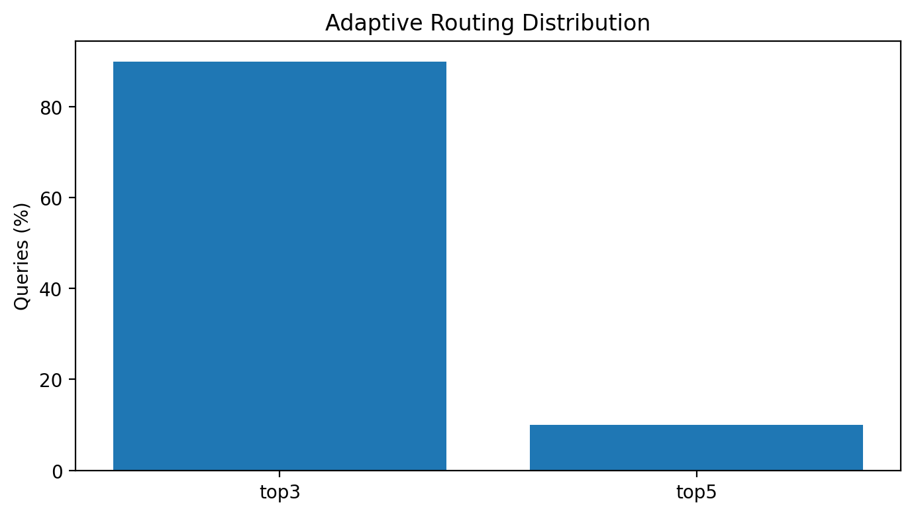
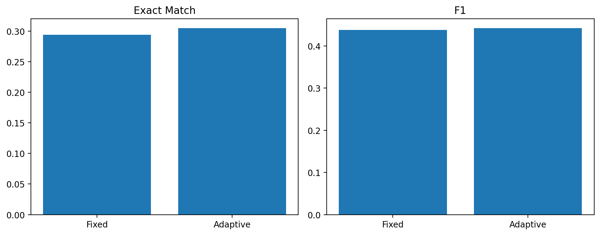
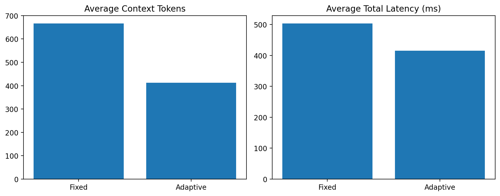
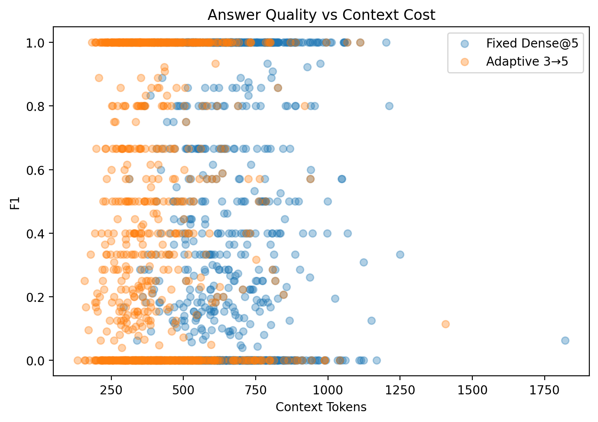

# Compute-Aware Adaptive RAG

A lightweight Retrieval-Augmented Generation system that dynamically allocates retrieval depth based on query difficulty, reducing context and inference cost while preserving answer quality.

## Results

| Metric | Fixed Dense@5 | Adaptive 3→5 | Improvement / Reduction |
|---|---:|---:|---:|
| Exact Match | 29.4% | **30.5%** | **+1.1 pp** |
| F1 | 43.8% | **44.3%** | **+0.5 pp** |
| Avg. Context Tokens | 667 | **412** | **38.2% ↓** |
| Avg. Retrieval Depth | 5.0 | **3.2** | **36.0% ↓** |
| Avg. Latency | 504 ms | **415 ms** | **17.6% ↓** |

The adaptive system uses the top-3 route for **90%** of queries and expands the remaining **10%** to top-5.

## Approach

### Fixed RAG

```text
Query
  ↓
BGE Dense Retrieval @5
  ↓
Qwen2.5-1.5B-Instruct
  ↓
Answer
```


### Adaptive RAG

The adaptive system begins with a lightweight semantic retrieval step and selectively expands the retrieval depth for queries predicted to benefit from additional evidence.

```text
Query
  ↓
BGE Dense Retrieval @3
  ↓
XGBoost Router
  ├── 90% → Keep Top-3
  └── 10% → Expand to Top-5
  ↓
Qwen2.5-1.5B-Instruct
  ↓
Answer
```

The XGBoost router ranks queries using dense-retrieval features including similarity scores, score gaps, query length, and score statistics. The highest-ranked queries receive additional retrieval.

## Approach

Standard RAG applies a fixed retrieval budget to every query. This project instead learns when additional retrieval is worth the extra context cost.

The system starts with the top-3 semantic results. An XGBoost router scores the query using retrieval-confidence features such as similarity scores, score gaps, query length, and score statistics. The highest-scoring queries are expanded to five passages.

The final policy uses:

* **90%** Top-3 retrieval
* **10%** Top-5 expansion



## Dataset

**HotpotQA (distractor configuration)**

* **5,000** examples for router training
* **1,000** examples for validation and routing-policy selection
* **1,000** held-out examples for final evaluation

## Models

* **Retriever:** `BAAI/bge-small-en-v1.5`
* **Generator:** `Qwen/Qwen2.5-1.5B-Instruct`
* **Router:** XGBoost
* **Vector Index:** FAISS

## Results Visualization
### Quality Comparison



### Context and Latency Comparison



### Answer Quality vs. Context Cost



## Key Idea

Instead of applying a fixed retrieval budget to every query, the system starts with a small semantic context and selectively allocates additional retrieval computation only to queries predicted to benefit from more evidence.

## Tech Stack

`Python` · `PyTorch` · `Hugging Face Transformers` · `Sentence Transformers` · `FAISS` · `XGBoost`
